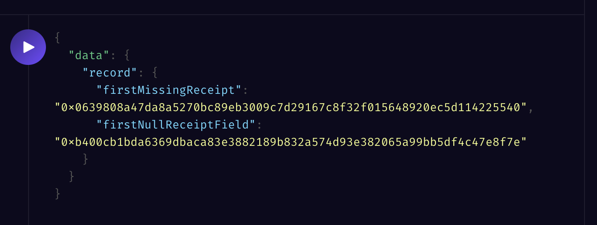
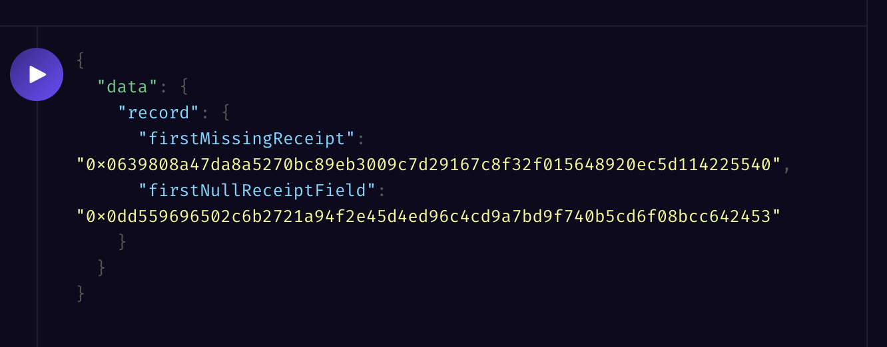

# Sample Graph `TransactionReceipt` Issue

This repository demonstrates inconsistencies with the `receipt: TransactionReceipt` field that was added for v0.0.7 mappings.

Depending on when you deploy it, you will get underministic behaviour from the Subgraph:

